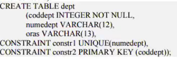
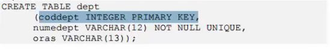
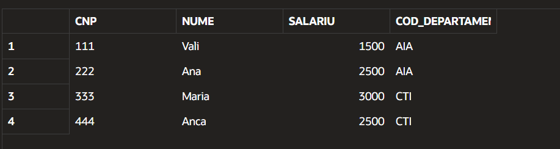
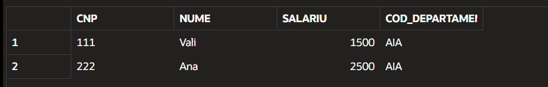

# SQL


LAB 1 (GENERAL)
-----

Notite:

`PRIMARY KEY` : un identifier unic, not null, pt fiecare record dintr-un table (fiecare element dintr un table trb sa aiba alta valoare)

`ed + /` : pt a edita ultima comanda data, si pt a trimite-o

`WHERE` - pt filtrare (SELECT, UPDATE...)

`ORDER BY (ASC/DESC)` - ASC by default

#### Comenzi:
```
CREATE TABLE tab (
	x integer PRIMARY KEY,
	y varchar(10) NOT NULL,
	z number(7,2) NOT NULL,
	d date
);
```
-Creeaza tabelul 'tab'
```
DESCRIBE tab;
```
-Descrie tabelul 'tab'

```
INSERT INTO tab VALUES(1, 'test', 70, '10.05.2018')
```
-Exemplu de insert

```
SELECT * FROM tab;
```
-Vizualizeaza toate record urile din tabel

```
UPDATE tab (numele tabel)
SET z = z-5 (expresia care sa se aplica)
WHERE y = 'test'; (conditia de filtrare)
```

```
SELECT trunct(sysdate - d) as CEVA;
```

```
WHERE y = 'test' OR y = 'test2' (OR, AND)
WHERE y LIKE 'N%' (sa inceapa cu N si sa vina orice dupa) ('%ct', '%ol%','____' - exact 4 caractere)
WHERE d IS (NOT) NULL
```
```
DELETE FROM tab WHERE ... (sau fara WHERE pt tot) (sterge record)
DROP TABLE tab (sterge tabelul)
```

LAB 2 (CONSTRAINTS SI ALTERARE)
-----

#### Notite

- `NOT NULL` - Coloana nu poate avea valori NULL
- `UNIQUE` - Valori unice (pot fi multiple NULL)
- `PRIMARY KEY` - Nu pot fi NULL, si trb sa fie unice
- `CHECK` - Conditie ce trb respectata de toate elementele

---
- `DEFAULT` - Valoarea implicita a coloanei, daca nu se mentioneaza alta

#### Comenzi :



sau



Alterare:

```
ALTER TABLE tab
    ADD nume_col tip_data;
    DROP COLUMN nume_col;
    MODIFY nume_col nou_tip_data;
    
    ADD CONSTRAINT nume_const def_const;
    DROP
        PRIMARY KEY;
        UNIQUE (nume_col);
```

Copiere tabel (gol):

```
CREATE TABLE tab2 AS
SELECT * FROM tab1
WHERE 1 = 0; (sau orice conditie false)

sau WHERE la row-urile pe care le vrei, gen 

CREATE TABLE Frigidere AS
SELECT * FROM tab1
WHERE Produs = 'Frigider';
```

Insert cu select :

```
INSERT INTO tab2
SELECT * (toate coloanele, sau putem specifica) FROM tab1
WHERE conditie
```

Adaugarea unui constraint de CHECK :

```
ALTER TABLE tab1
ADD CONSTRAINT chk_const1
CHECK (Discount BETWEEN 0 AND 1);
```

Adaugarea unei coloane : 

```
ALTER TABLE tab1
ADD Col varchar(20)
```

Modificarea unei coloane :

```
ALTER TABLE tab1
MODIFIY Old_col VARCHAR(20) <- Tipul nou de data
```

Stergerea unei coloane:

```
ALTER TABLE tab1
DROP COLUMN col_name
```

LAB 3 (GRUPARE)
----

#### Notite :

```
SELECT [DISTINCT] * / coloane [ [AS] alias]
FROM table
    WHERE - conditie de cautare asupra LINIILOR
    GROUP BY - lista de atribute care permit gruparea
    HAVING - conditie de cautare asupra GRUPARILOR
    ORDER BY
```

##### Functii de grup:

- `MIN` - returneaza minimul de pe o coloana
- `MAX` - returneaza maximul de pe o coloana
- `SUM` - returneaza suma de pe o coloana numerica
- `AVG` - returneaza media de pe o coloana numerica
- `COUNT` - returneaza numarul de articole care indeplinesc o anumita conditie

Select in select:

```
SELECT * FROM Evidenta_carti
WHERE Pret = (
    SELECT MAX(PRET) FROM Evidenta_Carti
    );
```

Group by:

```
SELECT Gen, COUNT(*) AS NR FROM Evidenta_carti
WHERE Pret IS NOT NULL
GROUP BY Gen
ORDER BY Gen DESC;
```

```
SELECT Editura, Gen, COUNT(*) as NR
FROM Evidenta_carti
GROUP BY Editura, Gen
ORDER BY Editura
```

```
SELECT Editura, COUNT(*) AS NR
FROM Evidenta_carti
GROUP BY Editura
HAVING COUNT(*) = (
    SELECT MIN(NR)
    FROM (
        SELECT COUNT(*) AS NR
        FROM Evidenta_carti
        GROUP BY Editura
    )
);
```

LAB 4 (FOREIGN KEYS .. REFERENCES)
----


References :
```
CREATE TABLE CONSULTATII (
  CNP CHAR(13) NOT NULL REFERENCES PACIENTI(CNP)   
)
```
- Verifica daca CNP-ul introdus in `CONSULATII` exista si in tabela `PACIENTI` **Daca nu exista, da eroare**
- O linie nu poate fi stearsa din tabela `PACIENTI` daca are 'fii' in tabela `CONSULATII`, de asemenea, daca exista linii in tabela `CONSULTAII`, aceasta trebuie **OBLIGATORIU** stearsa in prealabil, pt a putea sterge tabela `PACIENTI`

On delete cascade:
```
CREATE TABLE PLATI(
    Id_consult INTEGER NOT NULL REFERENCES CONSULTATII(Id_cosnult) ON DELETE CASCADE
)
```

- `ON DELETE CASCADE` indica faptul ca atunci cand o linie din tabela 'Parinte' (`CONSULTATII`) este stearsa, vor fi sterse si liniile dependente din tabela 'copil' (`PLATI`)

```
SELECT A.id_consult, A.CNP, A.plata - nvl(sum(B.Rata),0) as de_plata
FROM consultatii A, plati B
WHERE A.id_consult = B.id_consult (+)
GROUP BY A.id_consult, A.CNP, A.plata
HAVING nvl(sum(B.Rata),0) = 0
```

- `nvl()` returneaza prima valoare non-nula, de exemplu `nvl(NULL, 50)` returneaza `50`
- `(+)` Afiseaza toate liniile din A (`CONSULTATII`) chiar daca nu au match in B (`PLATI`) (`LEFT OUTER  JOIN`)

##### Tipuri de JOIN-uri

- INNER :
    
    Afiseaza doar liniile care au mathc in ambele tabele

- LEFT [OUTER] JOIN :

    Afiseaza TOT din stanga si ce gaseste in dreapta (Daca nu gaseste pune `NULL`)

- RIGHT JOIN :

    Afiseaza tot din dreapta + ce gaseste in stanga

- FULL OUTER JOIN :

    Tot din ambele tabele

- CROSS JOIN :
    
    Fiecare linie cu fiecare linie

LAB 5 (VEDERI)
----

```
CREATE VIEW nume_vedere AS subquery;
```
- `subquery` reprezinta o interogare de tip `SELECT` (practic un `SELECT` facut pe unul sau mai multe tabele)

Exemplu:
```
CREATE VIEW vedere1 AS  
(SELECT * FROM angajati  
   WHERE Cod_departament=’AIA’); 
```

---
```
SELECT * FROM vedere1;
```

```
INSERT INTO vedere1 VALUES ('444', 'Anca', 2500, 'CTI');
```

Tabelul angajati ulterior insert-ului:


Vederea vedere1 ulterior insert-ului:


# PL/SQL

LAB 6 (Blocuri/Functii)
---

Blocuri :
```
DECLARE
    declaratii variabile
BEGIN
    cod program  --comentarii
END
```

Exemplu:
```
DECLARE
    x INTEGER;
BEGIN
    x := 1000;
    DBMS_OUTPUT.PUT_LINE(x);
END;
```

- `:=` operatie de atribuire
- `DBMS_OUTPUT.PUT_LINE()` practic un print

Functii:
```
CREATE [OR REPLACE] FUNCTION
    nume_functie [(parametrii)]
RETURN (tip_parametru_return)
AS/IS
    [declarare variabile interne functiei]
BEGIN
    cod --comentariu
    [EXCEPTION]
END;
```

Rularea unei functii:

- Printr-o comanda:
```
SELECT functie1(param1, param2..) FROM DUAL;
```

- Utilizata ca parte a unei expresii: 
```
SELECT * FROM tabel WHERE camp1 < functie1;

-- SAU --

SELECT camp1 + functie1 FROM tabel;
```

- In interiorul unui bloc:

```
DECLARE
    x INTEGER := 100;
BEGIN
    DBMS_OUTPUT.PUT_LINE(functie1(x));
END;
```

Exemplu Functie + Explicatie:

```
CREATE OR REPLACE FUNCTION Clasificare (nr integer) -- Creeaza/Updateaza functia Clasificare, care ia ca paramentru numit nr, de tip integer
RETURN VARCHAR -- Tipul returnat de functie (nu trebuie mentionat VARCHAR(30), NUMBER(5,2),doar tipul)
IS/AS -- inceperea blocului de declarat variabile interne functiei
er EXCEPTION; --variabila interna, folosita pt exceptii
BEGIN -- inceperea blocului de cod
    IF (nr mod 2) = 0 THEN -- Classic if statement
        RETURN 'Numar par';
    ELSIF (nr mod 2) = 1 THEN
        RETURN 'Numar impar';
    ELSE
        RAISE er; --ridica eroare (salt controlat pana la zona de EXCEPTION, unde cauta WHEN-ul pt EXCEPTION-ul respectiv, daca nu il gaseste, merge la WHEN OTHERS)
    END IF;

EXCEPTION
WHEN er THEN
    RETURN 'Parametru invalid!';
WHEN OTHERS THEN
    RETURN 'Eroare!';
END;
```

Alt exemplu:

```
CREATE OR REPLACE FUNCTION operatii (var0 char, var1 number, var2 number)
RETURN VARCHAR 
IS
    rez NUMBER;
    ex EXCEPTION;
BEGIN
    IF (var0 = '+') THEN
        rez := var1 + var2;
        RETURN rez;
    ELSIF (var0 = '-') THEN
        rez := var1 - var2;
        RETURN rez;
    ELSIF (var0 = '*') THEN
        rez := var1 * var2;
        RETURN rez;
    ELSIF (var0 = '/') THEN
        rez := var1 / var2;
        RETURN rez;
    ELSE
        raise ex;
    END IF;

    EXCEPTION
        WHEN ex THEN
            RETURN 'Operator invalid!';
        WHEN ZERO_DIVIDE THEN
            RETURN 'Cannot divide by 0';
        WHEN OTHERS THEN
            RETURN 'EROARE NECUNOSCUTA';
END;
```

- `||` - operator pt concatanare string-uri in PL/SQL
- `to_date(string, 'dd-mm-yy')` din string in date 

**DATE DINTR UN TABEL IN FUNCTIE**
```
CREATE OR REPLACE FUNCTION func (var1 type)
RETURN type
AS/IS
    outside_var NUMBER;
BEGIN
    SELECT var
    INTO outside_var
    FROM table
    WHERE ___;

    ...
END;
```

LAB 7 (Proceduri)
----
Structura: 
```
CREATE [OR REPLACE] PROCEDURE
    nume_procedura [(parametrii)]
AS/IS
    [declaratii variabile interne]
BEGIN
    corp procedura
[EXCEPTION]
    exceptii
END
```

Apelul:
```
EXEC[UTE] nume_procedura(parametrii);
```

- Procedurile difera de functii prin faptul ca **NU RETURNEAZA VALORI** (**NU** pot fi direct in expresii)
- `RETURN` e implicit, nu poate contine o expresie
- Asemenea functiilor, nu poate fi stocata o interogare SQL clasica `SELECT`, poate fi folosita o comanda `SELECT ... INTO` spre una sau mai multe variabile
- Sectiunea `EXCEPTION` e la fel (specifica functiilor, procedurilor, trigger elor, si oricarui bloc de cod PL/SQL)

Exemplu:

```
CREATE OR REPLACE PROCEDURE afis(var varchar) AS
BEGIN
    DBMS_OUTPUT.PUT_LINE(var);
END;
```

Apel:

```
EXEC afis ('test');

-- SAU --

DECLARE
    var varchar(30) := 'test';
BEGIN
    afis(var);
END;
```

- Din proceduri poti insera in tabele :
```
CREATE OR REPLACE PROCEDURE prod.. IS
BEGIN
    INSERT INTO table VALUES(val1, val2)...etc
END
```

LAB 8 (Triggere/Declansatoare)
---

Structura: 
```
CREATE [OR REPLACE] TRIGGER nume_trigger
[BEFORE/AFTER] eveniment_declansator ON tabela
[REFERENCING {NEW AS new_row_name/ OLD as new_row_name}]
[WHEN (expresie_conditionala)]
[DECLARE]
    sectiune declarativa optionala
BEGIN
    corp trigger
[EXCEPTION]
    tratarea exceptiei
END;
```
STRUCTURA DE BAZA:
```
CREATE [OR REPLACE] TRIGGER nume_trigger
{BEFORE/AFTER} {INSERT/UPDATE/DELETE} ON nume_tabela
[FOR EACH ROW]
[DECLARE]
    variabile
BEGIN;
    corp
END;
```
- BEFORE - Trigger-ul ruleaza inainte ca datele sa fie scrise in tabela
- AFTER - Ruleaza dupa ce au fost scrise in tabela

---

`FOR EACH ROW`

- Cu `FOR EACH ROW` se declanseaza o data per linie afectata
- Fara `FOR EACH ROW` se declanseaza odata per comanda, indiferent cate linii afecteaza

```
UPDATE salarii SET nr_zile = 20 WHERE id IN (1,2,3)

-- Cu FOR EACH ROW se declanseaza de 3 ori (pt fiecare ROW afectat de comanda)

-- Fara FOR EACH ROW se declanseaza o singura data (o singura comanda data)
```
---

`:OLD / :NEW`

- Valori autonome, ce contin valorile liei afectate, un "snapshopt" al liniei inainte si dupa modificare (Se folosesc in corpul functiei)
- Disponibile doar cu `FOR EACH ROW`

Exemplu:
```
IF :NEW.pret_bucata < :OLD.pret_bucata THEN
    :NEW.pret_bucata := :OLD.pret_bucata;
    DBMS_OUTPUT.PUT_LINE('Scaderea pretului interzisa');
END IF;
```
**TABEL**
```
INSERT:  :OLD = NULL      :NEW = valoarea inserata
DELETE:  :OLD = val stearsa   :NEW = NULL
UPDATE:  :OLD = val veche     :NEW = val noua
```


---
`UPDATE OF coloana`

```
AFTER UPDATE OF nr_zile ON salarii
```

Trigger-ul se declanseaza doar cand se updateaza coloana nr_zile, nu la orice update pe tabela

---
**MUTATING TABLE**

Apare cand trigger-ul incearca sa faca DML pe aceeasi tabela care l-a declansat

```
CREATE OR REPLACE TRIGGER tr
AFTER INSERT ON tabela
BEGIN
    UPDATE tabela
    SET ...
END;
```
**Solutia**: Foloseste `BEFORE` + `FOR EACH ROW` si modifica direct prin `:NEW`

```
CREATE OR REPLACE TRIGGER tr
BEFORE INSERT ON tabela
BEGIN
 :NEW.camp := val_noua;
END;
```
---

**Reguli**

- Nu este posibila definirea unui trigger in urma unei operatii de `SELECT`
- Nu se poate folosi comanda clasica de `SELECT` in corpul unui trigger (trebuie `SELECT ... INTO`)
- Nu pot fi folositi parametri de intrare
- La `DROP TABLE` se sterg automat si triggerele asociate (se poate si `DROP TRIGGER nume_trg`)

---

Exemple evenimente declansatoare:
```
BEFORE INSERT ON nume_tabela
AFTER INSERT OR UPDATE OR DELETE ON numbe_tabela
AFTER UPDATE OF coloana1, coloana2 ON nume_tabela
```

Merita notat ca un poate fi un singur trigger pt mai multe operatii. Caz in care poti diferentia cu

- `INSERTING`
- `UPDATING`
- `DELETING`

Exemplu:

```
CREATE OR REPLACE TRIGGER tr
BEFORE INSERT OR UPDATE OR DELETE ON tabel
FOR EACH ROW
BEGIN
    IF INSERTING THEN
    ...

    ELSIF UPDATING THEN
    ...

    ELSIF DELETING THEN
    ...
    END IF;
END
```
